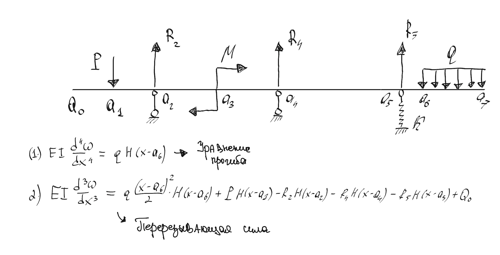
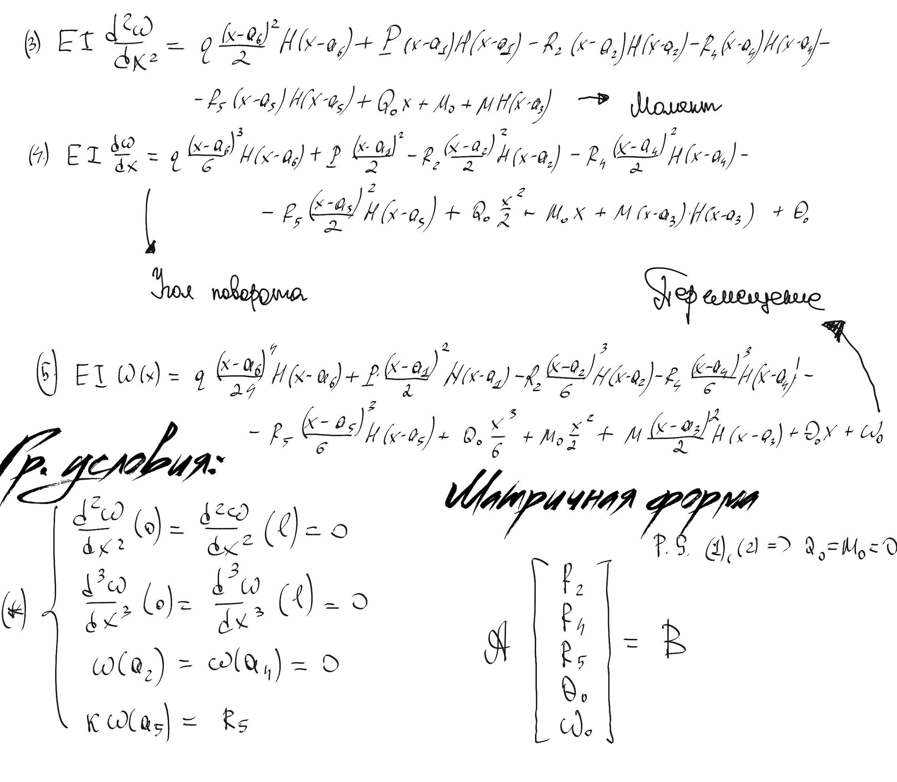

<p align="center">
  <a href="#wtf">Что это</a> •
  <a href="#install">Установка</a> •
  <a href="#launch">Запуск</a> •
  <a href="#modification">Модификация</a> •
  <a href="#faq">Вопросы</a> •
</p>

<a id="wtf"></a>
<h2 align="center">Что это</h2>

Скрипт, предназначенный для очистки и предобработки выгрузок чатов, фильтрующий сообщения пользователя в соответствии с логикой, прописанной в файле `init.json`.
Например, по умолчанию
``` json
{
  ...
  "params": {
    "maxSequences": "3",
    "minSequenceWords": "2",
    "maxSequenceLength": "15",
    "stopwords": [
      {
        "language": "ru",
        "path": "./data/words/stopwords/russian"
      },
      {
        "language": "en",
        "path": "./data/words/stopwords/english"
      }
    ],
  },
  ...
}
```
Оставляем только три сообщения пользователя, каждое из которых содержит не менее двух слов, не входящих ни в один из путей `@stopwords`.


<a id="install"></a>
<h2 align="center">Установка</h2>

1. Перейдите в папку со скачанным проектом
```bash
cd /path/to/your/project
```
Теперь выполнив `ls` из терминала вы должны видеть все файлы и папки проекта, как показано ниже:


2. Далее установите все дополнительные модули, используемые при обработке (находясь в той же самой директории проекта, как и в п.1).
```bash
sudo pip install -r requirments.txt
```

В случае успешной установки будет выведено сообщение, что все успешно установлено.


<a id="launch"></a>
<h2 align="center">Запуск</h2>

Для запуска просто запустите файл `main.py` либо из главной директории (директории проекта).
```bash
python main.py
```


<a id="modification"></a>
<h2 align="center">Модификация</h2>

Все параметры предобработки прописываются явно в `init.json`.
Например, поменять директорию, куда будут сохраняться обработанные файлы можно изменив относительный по умолчанию путь.
```json
{
  ...
  "output" : {
    "path" : "your/custom/relative/path/"
  }
  ...
}
```

<a id="faq"></a>
<h2 align="center">Вопросы</h2>

По всем вопросам писать на `Tarlinskiy.I.V[AT]sberbank[DOT]ru`
